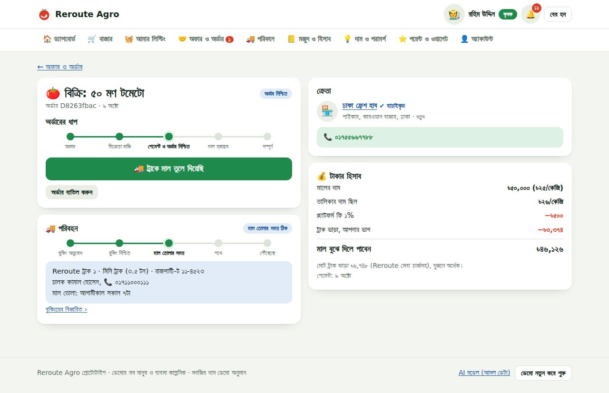
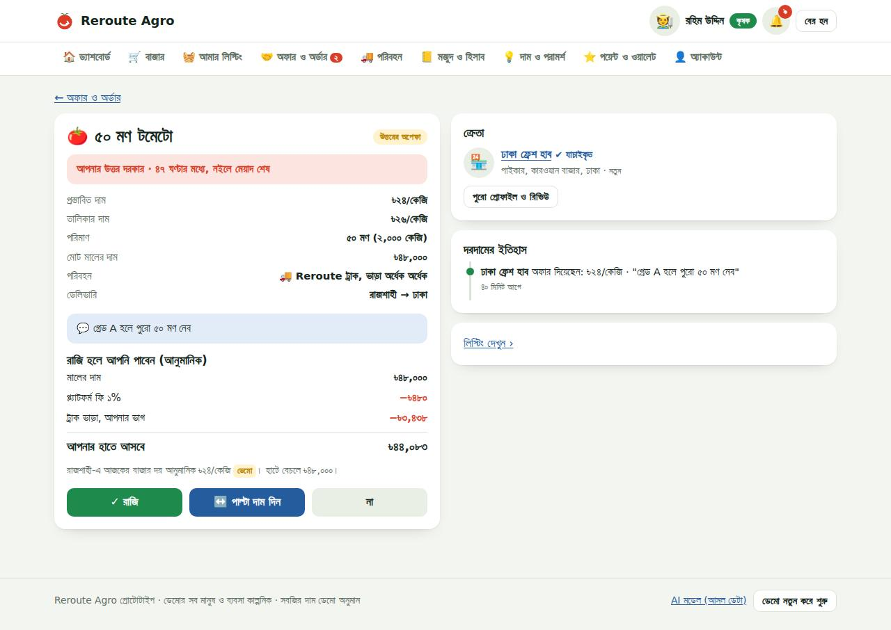
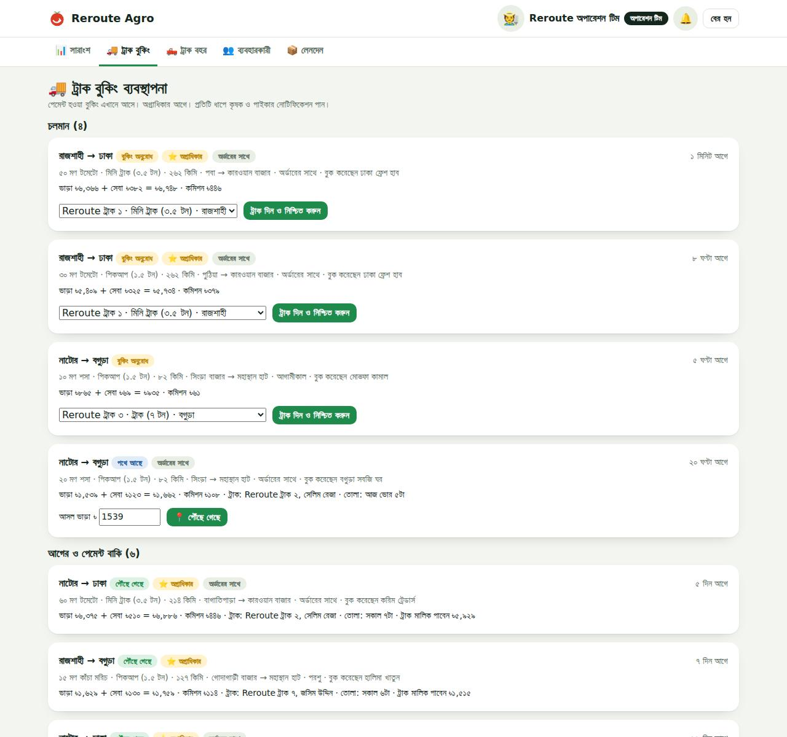
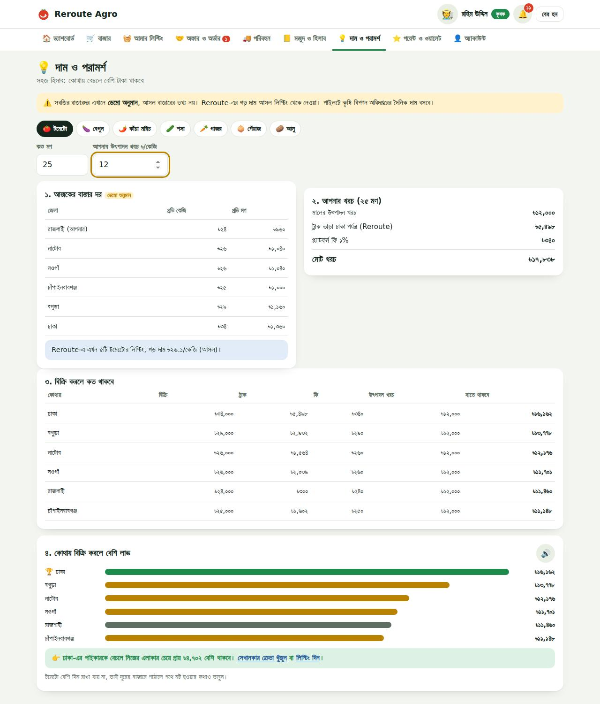

# 🍅 Reroute Agro

**কৃষক ও পাইকারের পাইকারি বাজার: সরাসরি দরদাম, নিরাপদ পেমেন্ট, নিজস্ব ট্রাক, মজুদ ও লাভ-ক্ষতির হিসাব।**
Built for **Hack for Humanity**.

| | |
|---|---|
| 🌐 লাইভ প্রোটোটাইপ | "https://reroute-agro-k0of.onrender.com" |
| 📸 শোকেস: ছবি, ডেমো অ্যাকাউন্ট, ট্যুর | GitHub Pages (`docs/`) |
| 🔑 ডেমো |· পেমেন্ট পিন **১২৩৪৫** |

<p align="center"> </p>
<p align="center"> </p>

## সমস্যা
বাংলাদেশে ফল আর সবজির ২৫ থেকে ৪০ ভাগ তোলার পরেই নষ্ট হয়ে যায়। মৌসুমে সবাই একই হাটে মাল আনেন, দাম পড়ে যায়, অথচ কয়েক ঘণ্টা দূরের বাজারে তখনও দাম ভালো। কৃষক জানেন না কে কিনবে, পাইকার জানেন না কার কাছে তাজা মাল আছে, আর ট্রাক ভাড়া কত পড়বে সেটা আগে থেকে বোঝার উপায় নেই। আমরা এই তিনটা সমস্যা এক জায়গায় সমাধান করার চেষ্টা করেছি।

## সমাধান
| | কৃষক | পাইকার |
|---|---|---|
| বিক্রি | ছবি, মান, পরিমাণ, সর্বনিম্ন অর্ডার দিয়ে লিস্টিং | নিজের মজুদ থেকে লিস্টিং |
| কেনা | অন্য কৃষক/পাইকারের মাল (পাইকারি, অন্তত ৫ মণ) | খোঁজ ও ফিল্টার করে, আগে ভিডিও/সরাসরি দেখে, অফার |
| দরদাম | রাজি / পাল্টা দাম / না | তালিকার দাম বা কম দামে অফার, পাল্টা দামে রাজি / না |
| টাকা | মাল বুঝে দিলে ওয়ালেটে, ১% ফি | বিকাশ / নগদ / কার্ড / ওয়ালেট, টাকা Reroute-এ জমা থাকে |
| পরিবহন | Reroute ট্রাক, ভাড়া ভাগ করা যায় | Reroute ট্রাক বা নিজের ট্রাক |
| হিসাব | মজুদ, বিক্রির ইতিহাস, লাভ-ক্ষতি | মজুদ, কেনা-বেচার ইতিহাস, লাভ-ক্ষতি |

## কেনাবেচা। 
কৃষক ছবি, মান আর পরিমাণ দিয়ে মাল বাজারে তোলেন। পাইকার খুঁজে, ফিল্টার করে, চাইলে আগে ভিডিও কলে বা গিয়ে মাল দেখে অফার দেন। বিক্রেতা রাজি হতে পারেন, পাল্টা দাম দিতে পারেন, বা না বলতে পারেন। শুধু পাইকারি, সর্বনিম্ন অর্ডার ৫ মণ।

টাকা। ক্রেতা বিকাশ, নগদ, কার্ড বা ওয়ালেট দিয়ে পেমেন্ট করেন (এখন ডেমো গেটওয়ে)। টাকা Reroute-এ জমা থাকে, ক্রেতা মাল বুঝে পেয়েছি চাপলে তবেই বিক্রেতার ওয়ালেটে যায়। ২৪ ঘণ্টায় পেমেন্ট না হলে অর্ডার নিজে থেকে বাতিল হয়ে মাল আবার বাজারে ফেরে।

### 🚚 Reroute ট্রাক (আলাদা মডিউল)
- নিজস্ব বহর: পিকআপ ১.৫ টন, মিনি ট্রাক ৩.৫ টন, ট্রাক ৭ টন। অর্ডারের সাথে বা আলাদা বুক করা যায়।
- ধাপ: **বুকিং অনুরোধ → নিশ্চিত (ট্রাক দেওয়া) → মাল তোলার সময় ঠিক → পথে → পৌঁছেছে**। প্রতি ধাপে কৃষক ও পাইকার নোটিফিকেশন পান।
- ভাড়া = দূরত্ব × গাড়ির ধরন × ওজন। কম মাল হলে শেয়ার্ড ট্রাক (নিজের ভাগ + ২০%), পুরো ট্রাকে ফেরার পথের মালের জন্য ১৫% কম। উপরে ৮% সেবা চার্জ। বাজারে নিজে ট্রাক ভাড়ার চেয়ে প্রায় ২০–৪৮% কম; বুক করার আগেই দুটোই দেখায়।
- অপারেশন টিমের প্যানেল: বুকিং সারি (অগ্রাধিকার আগে), ট্রাক দেওয়া, সময় ঠিক, পথে, পৌঁছানো ও আসল ভাড়া; বহরে ট্রাক যোগ, মেরামতে পাঠানো।

### 💰 আয়ের মডেল (একই সেবার জন্য দুবার চার্জ নেই)
| উৎস | হার |
|---|---|
| প্ল্যাটফর্ম ফি | বিক্রির ১% (ন্যূনতম ৳১০, সর্বোচ্চ ৳৫০০), শুধু বিক্রেতার কাছ থেকে |
| ট্রাক সেবা চার্জ | ভাড়ার ৮%, ব্যবহারকারী দেন |
| ট্রাক মালিকের কমিশন | ভাড়ার ৭% |
| Reroute প্লাস (পাইকার) | ৳৯৯৯ / ৩০ দিন: জরুরি মালের খবর আগে, ট্রাক সেবা চার্জে ২৫% ছাড়, অগ্রাধিকার |

প্ল্যাটফর্মে থাকার কারণ: টাকার নিরাপত্তা (এসক্রো), সস্তা ট্রাক, রেকর্ড ও হিসাব, রেটিং, পয়েন্ট।

### ⭐ পয়েন্ট ও পুরস্কার
- **আয়:** সম্পূর্ণ বিক্রিতে প্রতি মণে ১, কেনায় প্রতি ২ মণে ১, Reroute ট্রাকে মাল পৌঁছালে +১০, ছবি ও মানের তথ্যসহ লিস্টিংয়ের প্রথম বিক্রিতে +১০, প্রোফাইল যাচাইয়ে +৫০।
- **ব্যবহার:** ২০০ পয়েন্টে পরিবহনে ৳১০০ ছাড়, ৩০০ পয়েন্টে পরের বিক্রির ফি-তে ৳১৫০ ছাড়।
- **ক্যাশব্যাক:** যাচাইকৃত কৃষকের ৳২০,০০০+ সফল বিক্রিতে ৳৫০ (সপ্তাহে ৩ বার)। ফি থেকেই আসে, তাই আয় কমে না।
- **অগ্রাধিকার ট্রাক:** যাচাইকৃত কৃষক ও প্লাস সদস্য। **নিয়মিত ক্রেতা:** ৩০ দিনে ৫+ কেনায় সেবা চার্জে ২০% ছাড়।
- **ভুয়া লেনদেন ঠেকাতে:** পয়েন্ট শুধু পেমেন্ট হওয়া ও সম্পূর্ণ অর্ডারে, অন্তত ৳৫,০০০-এর বিক্রিতে, একই ক্রেতা-বিক্রেতা জোড়া সপ্তাহে ৩ বারের বেশি নয়।

### 📒 মজুদ, ইতিহাস, লাভ-ক্ষতি
- **মজুদ:** হাতে আছে, বাজারে তালিকায়, অর্ডারে আটকে, তালিকার বাইরে, এ পর্যন্ত বিক্রি/কেনা, পথে আসছে, গড় খরচ। অর্ডার সম্পূর্ণ হলে নিজে থেকে বদলায়।
- **ইতিহাস:** ধরন, ফসল, অবস্থা, সময় ও নাম দিয়ে ফিল্টার; তালিকার দাম বনাম চূড়ান্ত দাম, পরিবহন ও ফি।
- **লাভ-ক্ষতি:** বিক্রি − মালের খরচ − পরিবহন − ফি − অন্যান্য খরচ। খরচ জানা না থাকলে "আনুমানিক" বলে, ভুল দাবি করে না। প্রতি অর্ডারের আলাদা হিসাব আর একটি ক্যালকুলেটর।
- প্ল্যাটফর্মের বাইরের বিক্রি, মজুদ ও খরচ হাতে লেখা যায়।

### 💡 দাম ও পরামর্শ (সহজ ভাষায়)
আজকের বাজার দর → আপনার খরচ → বিক্রি করলে কত থাকবে → কোথায় বিক্রি করলে বেশি লাভ (পাইকারের জন্য: কার কাছ থেকে কিনে বেচলে লাভ, সর্বোচ্চ কত দামে কেনা যায়)। **সবজির বাজারদর ডেমো অনুমান, পাতায় স্পষ্ট লেখা।** Reroute-এর গড় দাম আসল লিস্টিং থেকে।

### 🤖 AI (আসল ডেটা)
*Food Commodity Price (OHLC) Dataset of Bangladesh*: ৭৬টি বাজার, ২০০৭–২০২৫। Gradient boosting মডেল পরের মাসের দাম বলে; অদেখা ২০২৩–২০২৫-এ দাম বাড়বে না কমবে **৭০.৮%** সঠিক, গড় ভুল ১.৭৩% (সাধারণ অনুমানে ১.৭৭%)। ডেটাসেটে সবজি নেই, তাই পাইলটে কৃষি বিপণন অধিদপ্তরের সবজির দামে একই মডেল চলবে। পরিবহনে নষ্টের হিসাবে ওই জেলার ওই মাসের গড় তাপমাত্রা ব্যবহার হয়।

### 🔒 গোপনীয়তা
পাবলিক প্রোফাইলে শুধু নাম, ছবি, ধরন, এলাকা, যাচাই, রেটিং, সম্পূর্ণ লেনদেনের সংখ্যা ও চালু লিস্টিং। ফোন নম্বর শুধু পেমেন্ট হওয়া অর্ডারের দুই পক্ষ দেখেন। টাকার হিসাব নিজে ছাড়া কেউ দেখে না।

---

## 🧪 ডেমো
লগ ইন পাতায় এক চাপে ঢোকা যায় (সব মানুষ ও ব্যবসা কাল্পনিক):
| অ্যাকাউন্ট | যা দেখবেন |
|---|---|
| **রহিম উদ্দিন** (কৃষক) | একটি কম দামের অফার (রাজি / পাল্টা দাম / না), একটি পরিদর্শনের অনুরোধ |
| **করিম ট্রেডার্স** (পাইকার) | একটি পাল্টা দাম, রাজি হলে পেমেন্ট |
| **বগুড়া সবজি ঘর** (পাইকার) | পথে থাকা মাল, পৌঁছালে "বুঝে পেয়েছি" |
| **Reroute অপারেশন টিম** | ট্রাক বুকিং, বহর, যাচাই, আয় |

ডেমো পেমেন্ট পিন **১২৩৪৫** (অন্য পিনে ব্যর্থ পেমেন্ট দেখায়)। ফুটারের "ডেমো নতুন করে শুরু" সব আগের অবস্থায় ফেরায়। ডেমো ডেটা অ্যাপের আসল ফাংশন দিয়ে তৈরি, তাই মজুদ, টাকা, পয়েন্ট ও লাভ-ক্ষতি একে অপরের সাথে মেলে।

## 🏗 Architecture
```
Browser (HTML/CSS/JS, Bangla, mobile-first) ── fetch /api/* (every 5 s for live updates)
        │
FastAPI  app/main.py      routes, signed-token login (survives restarts)
         app/services.py  business rules: listings, offers, payments, orders, transport, points, P/L
         app/logic.py     prices, fees, truck fares, rewards (single source of numbers)
         app/db.py        SQLite schema        app/seed.py  demo data via the real functions
         app/ai.py        loads models/price_model.joblib (trained by ml/train.py)
```
```
app/  ml/  models/  data/raw/  static/index.html (built from web/*)  web/ (frontend source)
requirements.txt  render.yaml  Dockerfile  build.py
```

## ▶️ Run
```bash
pip install -r requirements.txt
uvicorn app.main:app --reload        # http://127.0.0.1:8000   API docs: /docs
python build.py                      # after editing web/*, rebuild static/index.html
python -m ml.train                   # retrain the price model
```
## 🌐 Deploy & keep it available
- **Render:** New + → Blueprint → this repo (`render.yaml`).
- **Keep awake:** a free UptimeRobot HTTP monitor on `<live-url>/api/health` every 5 minutes (Render's free 750 h/month covers one service all month).
- **Demo stays fresh:** when the demo data is older than 12 h and nobody has changed anything for 30 min, it is rebuilt automatically (`DEMO_TTL_HOURS`, `DEMO_AUTO_REFRESH`). Footer button "ডেমো নতুন করে শুরু" resets it any time.
- **GitHub Pages showcase:** Settings → Pages → branch `main`, folder `/docs`. Set `LIVE_URL` / `VIDEO_URL` at the top of `docs/index.html`; the page shows whether the live server is up and always shows the screenshots.

## 🗺 Next
Real bKash/Nagad gateway, DAM vegetable prices, Bangla IVR calls for farmers, GPS truck tracking, more districts and crops.

## 🤖 AI পরামর্শ (সিমুলেটেড সবজি ডেটা)
মেনুতে **🤖 AI পরামর্শ** (`#/advisor`), তিনটি অংশ:
- **কৃষক: কোথায় ও কবে বেচবেন।** প্রতিটি বাজারে, আজ/কাল/পরশু পাঠালে হাতে কত থাকবে: AI-র দামের পূর্বাভাস − পথে ও অপেক্ষায় নষ্ট − বাজার খরচ ও Reroute ফি − ট্রাক ভাড়া। সবচেয়ে লাভের বাজার, কোথায় কম পাবেন, উৎপাদন খরচ দিলে কোথায় লোকসান, আর কারণ (আমদানি বেশি/কম, দাম বাড়বে/কমবে)।
- **পাইকার: কোথায় কম দামে ভালো মাল।** Reroute লিস্টিং ও জেলার বাজার, পৌঁছে খরচ বনাম কাল নিজের বাজারে বেচার পূর্বাভাসিত দাম; মান, তাজা থাকার দিন, রেটিং; কোথায় শিগগির দাম কমবে; ৮% লাভ রাখতে সর্বোচ্চ কেনা দাম।
- **বাজারের অবস্থা।** সব বাজারে আজকের দাম, আগামী ৩ দিন, আমদানি, glut সতর্কতা।

**ডেটা:** `data/simulated/veg_prices_bd_sim.csv` (সিমুলেটেড, প্রতিটি সারিতে লেখা) ৬টি বাজার × ৭টি সবজি, ২০২১ থেকে প্রতিদিন। নিয়মগুলো `ml/vegsim.py`-তে, বিবরণ `data/simulated/README.md`-এ। আবহাওয়ার মাসিক গড় আসল Food Commodity Price Dataset থেকে।
**মডেল:** `ml/train_veg.py`, gradient boosting, ১–৩ দিনের দাম। অদেখা জুলাই ২০২৫–অক্টোবর ২০২৬-এ: কালকের দামে গড় ভুল ৬.৫% ("দাম একই থাকবে" ধরলে ৮.০%), ৩ দিনে ১০.১% (১৩.২%); AI-র বাজার বাছাই মানলে স্থানীয় হাটের চেয়ে গড়ে মণে ৳৩১৪ বেশি (সিমুলেশনের ফল, আসল দাবি নয়)।
সার্ভার প্রতিদিন আজ পর্যন্ত ডেটা বানিয়ে পূর্বাভাস নতুন করে। কোড: `app/veg_ai.py`, `app/ai_routes.py`, `web/5b_ai_advisor.js`; `main.py`-তে শুধু router যোগ।
```bash
python -m ml.vegsim        # dataset
python -m ml.train_veg     # model + metrics
```

## 🗄️ Database
- `DATABASE_URL` দিলে **PostgreSQL** (যেমন ফ্রি Neon/Supabase): রিস্টার্ট বা নতুন deploy-এর পরও ডেটা থাকে।
- না দিলে **SQLite** `data/reroute.db` (Render-এর ফ্রি ডিস্কে রিস্টার্টে মুছে যায়)।
- ডেমো রিফ্রেশে ডেমোর কেনাবেচা নতুন হয়, কিন্তু নিজে খোলা অ্যাকাউন্ট থাকে।
